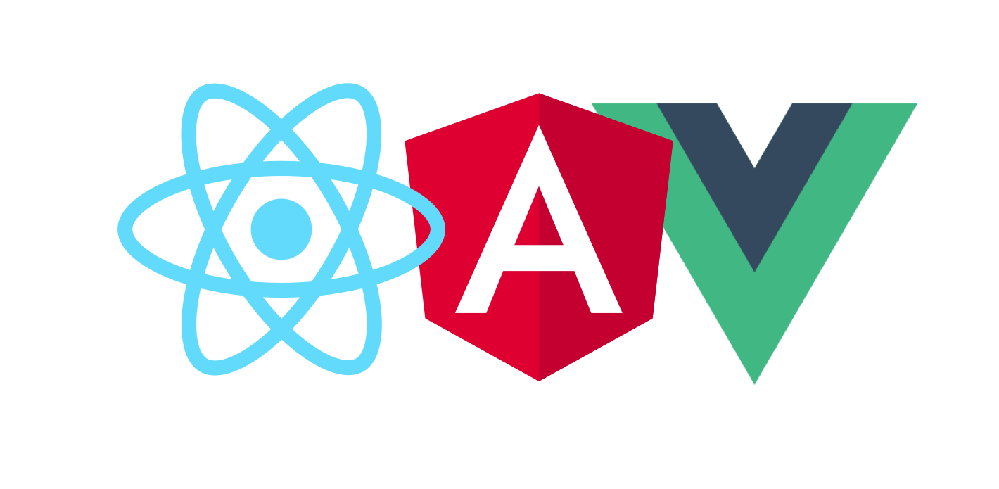
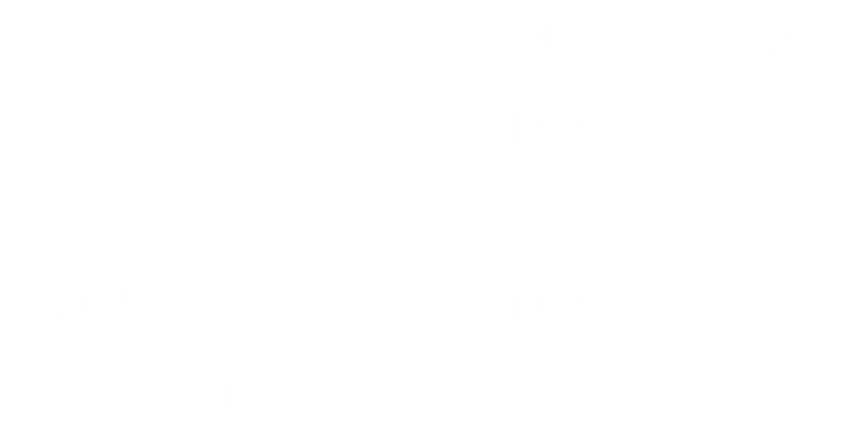

JavasSript 101 자바스크립트 기본 자료 정리

# JavaScript 소개
## JavaScript?
* HTML과 CSS는 정적인 언어
* JavaScript는 HTML과 CSS로 만들어진 웹페이지를 동적으로 변경해주는 언어
* HTML, CSS 기본적인 선행학습 필요
* 작성한 코드를 브라우저에서 바로 실행 가능

## JavaScript의 역할
* HTML 엘리먼트 추가/삭제 및 CSS 스타일 변경
* 폼 유효성 검증
* 사용자와의 상호작용 (마우스, 키보드, 터치)
* 웹 브라우저 쿠키 설정/조회
* AJAX 이용한 웹 서버와 통신

## 과거 JavaScript는?
초창기 웹페이지의 보조적인 기능을 수행하기 위한 용도로 사용
* 1995년 브렌던 아이크(Brendan Eich) 넷스케이프 지원
* 모카 -> 라이브스크립트 -> 자바스크립트
* 국제 표준화 단체인 ECMA International에서 JavaScript 표준화 진행
* 크로스 브라우징, 보안 취약점 문제
* 전문적이지 못한 인식 (Copy & Paste)

## JavaScript 환경 변화
데이터의 유형이 텍스트 -> 이미지 -> 미디어로 진화 (개발비용, 난이도, 복잡도 증가)<br>
과거에 서버에서 담당하던 역할들이 상당 부분 프론트 이동

* Ajax - 전체 페이지를 다시 렌더링하지 않고 변경되는 부분만 갱신
* jQuery - 보다 쉽게 DOM을 핸들링
* HTML5 - 마크업, JavaScript API를 강화
* NodeJS - 서버 개발 가능, 더 많은 개발자들이 자바스크립트 사용
* ECMAScript2015 (ES6) - 언어로서의 완성도가 높아짐

## 현재 자바스크립트는?


브라우저에서만 사용하는 용도를 벗어나 다양한 환경에서 폭넓게 활용
* MeanStack (Full Stack Javascript Framework)
* 클라이언트 / 서버 / 데이터베이스 모두 자바스크립트 기반 (JSON 형태로 통신)
* 모바일 앱(iOS & Android), 데스크탑 앱

## SPA (Single Page Application)


* PC -> 모바일 사용자의 증가 (트래픽 감소와 속도, 사용성, 반응성 이슈)
* 프론트엔드 프레임워크의 강화 (React, Angular, Vue)
* 필요한 모든 정적 리소스를 최초에 한번 다운로드
* 페이지 이동없이 고속으로 화면 전환
* 네이티브 앱과 유사한 사용자 경험 제공

## PWA (Progressive Web Apps)


최적화된 웹 성능에 모바일의 Native 기능을 결합한 최신 웹 앱
* 모바일 앱의 단점 (개발, 빌드, 배포, 검색 다운로드, 설치)
* 홈 화면 아이콘 추가, 오프라인 서비스, 푸시 알림 등 웹에서도 가능하게 하는 기술 (Service Worker, Manifest)

# JavaScript 시작
## 코드 작성 준비
* 아래 코드를 HTML head, body 태그 안에 작성
* script 태그의 src 속성을 사용하여 외부 js 파일 연결
```html
<!-- internal -->
<script type="text/javascript">
    //코드 작성

    //한줄주석
    /* 여러줄 주석 */
</script>

<!-- external -->
<script type="text/javascript" scr="js/ui/ui-base.js"></script>
```

## script 태그 위치
```html
<!DOCTYPE html>
<html>
<head>
    <title>HTML Page</title>
    <!--Bad-->
    <script scr="js/lib/jquery-1.9.1.min.js"></script>
    <script scr="js/ui/ui-base.js"></script>
</head>
<body>
    ...
    <!--Good-->
    <!--body 요소 안, 맨 마지막 위치-->
    <script scr="js/lib/jquery-1.9.1.min.js"></script>
    <script scr="js/ui/ui-base.js"></script>
</body>
</html>
```

## script 태그 속성
script src="script.js"


script **async** src="script.js"


script **defer** src="script.js"


# 변수 (Variable)
## 변수 선언
* 숫자로 시작 할 수 없음
* 대소문자 구별
* 이미 정의된 예약어 사용 안됨 (var, function, new, typeof..)
```js
var number;
var str;

//한번에 선언 (콤마를 이용해 구분)
var number, str;

//숫자시작 X
var 1st = 10; //SyntaxError

//대소문자 구분, 완전히 다른변수
var value = 25;
var Value = 26;

//예약어 X
var function; //SyntaxError
```

## 변수의 중복 선언
변수의 중복 선언은 문법적으로 허용, 하지만 사용하지 않는 것이 좋음
```js
var x = 1;
console.log(x); //1

//중복 선언 (재정의)
var x = 100;
console.log(x); //100
```

## 변수 선언 시 var 키워드 생략 허용
의도하지 않게 변수를 전역화할 수 있으므로 사용하지 않는 것이 좋음
```js
x = 1;
console.log(x); //1
```
## 분산된 var 선언의 문제
```js
function myFunction() {
    console.log(foo); //① undefined
    //Why no ReferenceError? 예기치 않은 결과

    if(true) {
        var foo = 123;
        console.log(foo); //② 123
    }
}

myFunction();
```

## 변수 호이스팅 (Hoisting)
코드를 해석하기 전 var 선언 범위를 각 함수(스코프)의 상단으로 끌어 올림

```js
function myFunction() {
    //var foo; -> 변수는 호이스트 되었습니다.
    console.log(foo); //① undefined

    if(true) {
        var foo = 123;
        console.log(foo); //② 123
    }
}

myFunction();
```
첫 줄 이후 선언된 변수들은 호이스팅으로 인해 선언한 곳 이전부터 존재.
모든 변수들을 최상위에 함께 선안하고 값을 초기화 하는 것이 호이스팅으로 인해 발생할 수 있는 문제들을 줄일 수 있음

## 자료형 (Data type)
* 기본 자료형 - Boolean, null, undefined, Number, String, Symbol
* 객체형 - Object (Function, Array, Date, RegExp)
* 동적 타입 언어, 느슨한 타입 언어
* 변수 선언 시 타입 정의 없음
* 값을 할당할 때 데이터 형이 결정되는 것이 특징
* 같은 변수에 여러 데이터 타입의 값을 대입 가능 (가능한 변경하지 않는다)
```js
//값을 할당하지 않은 변수는 기본적으로 undefined
//자료형이 결정되지 않은 상태
var foo;
console.log(typeof foo); //undefined

//null은 개발자가 의도적으로 빈 값을 할당 (비어있는 변수)
var foo = 'Kim';
foo = null;  //참조 정보가 제거됨

foo = 3;
console.log(typeof foo);  //number

foo = 'Hi';
console.log(typeof foo);  //string

foo = true;
console.log(typeof foo);  //boolean

숫자를 다루다 보면 숫자 범위를 초과하거나 오류로 NaN
NaN (Not a Number) 숫자가 아니라는 뜻
```

## 네이밍 규칙
변수의 데이터 타입과 용도에 따라 접두사와 함께 붙여 사용 (헝가리안 표기법)
<table>
    <tr>
        <th style="text-align:left">접두사</th>
        <th style="text-align:left">데이터 타입</th>
        <th style="text-align:left">예시</th>
    </tr>
    <tr>
        <td>a</td>
        <td>Array</td>
        <td>aUsers</td>
    </tr>
    <tr>
        <td>s</td>
        <td>String</td>
        <td>sCompanyName</td>
    </tr>
    <tr>
        <td>n</td>
        <td>Number</td>
        <td>nTotalCount</td>
    </tr>
    <tr>
        <td>b</td>
        <td>Boolean</td>
        <td>bFlag, bActivation</td>
    </tr>
    <tr>
        <td>o</td>
        <td>Object</td>
        <td>oController</td>
    </tr>
    <tr>
        <td>ht</td>
        <td>Hash Table</td>
        <td>htUserInfo, htColorCode</td>
    </tr>
    <tr>
        <td>d</td>
        <td>Date</td>
        <td>dToday, dCurrentTime</td>
    </tr>
    <tr>
        <td>el</td>
        <td>Html Element</td>
        <td>elTableList</td>
    </tr>
    <tr>
        <td>rx</td>
        <td>Regular Expression</td>
        <td>rxEmailFormat</td>
    </tr>
</table>

## '==' vs '==='의 차이
* 동등 연산자 (==, !=) 값이 같으면 true (강제 형 변환 후 비교)
* 일치 연산자 (===, !==) 값이 같고 데이터 타입도 같아야만 true
* ==보다는 ===를 쓰는 것을 권장
```js
0 == ''     //true
0 == '0'     //true
1 == true     //true
null == undefined    //true

0 === ''     //false
0 === false    //false
1 === true     //false
null === undefined     //false
```

# 배열 (Array)
## 배열 생성
여러 개의 데이터 값을 하나의 변수에 할당할 때 사용
```js
var arr1 = []; //배열 리터럴 사용
var arr2 = new Array();
```

## 배열 요소 추가
* 필요한 index 위치에 값 할당 (순서에 맞게 값을 할당할 필요는 없음)
* 값이 할당되지 않은 index 요소의 값은 empty
* 배열의 길이는 최종 index 기준으로 산정
```js
//배열 요소에 index로 값 할당
var fruits = [];
fruits[0] = '사과';
fruits[1] = '배';
fruits[2] = '바나나';

//배열을 생성과 동시에 요소에 값 할당
var fruits = ['사과', '배', '바나나'];

var arr = [];
arr[0] = 'one';
arr[3] = 'three';
arr[7] = 'seven';
console.log(arr); //["one", empty × 2, "three", empty × 2, "seven"]
```

## 배열 요소 열거
배열 뒤 [ ]안에 index를 넣어 요소에 접근
```js
var fruits = ["사과", "배", "바나나"];
console.log(fruits[0]); //사과
console.log(fruits[1]); //배
console.log(fruits[2]); //바나나

//요소 갯수 (배열 길이)
console.log(fruits.length); //3

//for문 사용
for (var i = 0; i < fruits.length; i++) {
    console.log(i, fruits[i]); //0 사과, 1 배, 2 바나나
}
```
## 배열 메서드 (Array method)
* join – 문자열로 리턴
* reverse – 거꾸로 변경
* sort – 배열 정렬
* concat – 배열 이어 붙임
* slice – 부분 배열 반환
* splice – 삭제/추가
* push, pop – 맨뒤 추가/삭제
* shift, unshift – 맨앞 추가/삭제

```js
var testArray = ['aaa', 'bbb', 'ccc', 'ddd'];

//forEach - 배열의 모든 요소에 EDIT라는 문자열을 더하기, 메서드 수행 후 리턴값은 undefined
testArray.forEach(function (item, index, array) {
    array[index] = item + 'EDIT';
});
//메서드 수행 후 
console.log(testArray);
['aaaEDIT', 'bbbEDIT', 'cccEDIT', 'dddEDIT']


//map - 배열의 모든 요소에 NEW라는 문자열을 더하기, 메서드 수행 후 리턴값은 새로운 배열
var newArray = testArray.map(function (item, index, array) {
	return item + 'NEW';
});
//메서드 수행 후 원본 배열
console.log(testArray);
['aaa', 'bbb', 'ccc', 'ddd']
//메서드 수행 후 생성된 배열
console.log(newArray);
['aaaNEW', 'bbbNEW', 'cccNEW', 'dddNEW']


//filter - 배열의 요소가 a, b로 이루어져 있는것만 추출, 메서드가 종료되면 추출된 요소로만 이루어진 새로운 배열을 리턴
var newArray = testArray.filter(function (item, index, array) {
	return !!~item.search(/[ab]+/);
});
//메서드 수행 후 원본 배열
console.log(testArray);
['aaa', 'bbb', 'ccc', 'ddd']
//메서드 수행 후 생성된 배열
console.log(newArray);
['aaa', 'bbb']


var testArray = [1, 2, 3, 4, 5, 6, 7, 8, 9, 10];

//reduce - 각 콜백마다의 리턴값을 previousItem 으로 넘겨받아 어떤 작업을 수행, 메서드가 종료되면 마지막 콜백의 리턴값을 리턴
var result = testArray.reduce(function (previousItem, currentItem, index, array) {
	//반환된 결과는 다음번 콜백의 첫번째 파라메터로 다시 전달
	return previousItem + currentItem;
}, 0);
//메서드 수행 후 원본 배열
console.log(testArray);
[1, 2, 3, 4, 5, 6, 7, 8, 9, 10]
//메서드 수행 후 리턴값은 0부터 10까지의 합
console.log(result); //55


var data = [1, 2, 3, 4, 5];

//every - 배열의 모든 값이 조건 만족 true, 수행 중 false가 있으면 바로 수행 중단
var isAllOdd = data.every(val => { return val % 2 != 0 });
console.log(isAllOdd); //false

//some - 하나라도 특정 조건을 만족하면 true, 수행 중 true가 있으면 바로 수행 중단
var isSomeOdd = data.some(val => { return val % 2 != 0 });
console.log(isSomeOdd); //true
```

# 객체 (Object)
## 자동차 객체
* 현실세계의 객체를 프로그래밍적으로 접근하여 접목시킨 것을 객체라고 표현
* 모든 자동차는 같은 속성을 가지고 있지만 그 값은 각각 다르고, 다양한 기능을 수행
<table>
    <tr>
        <th style="width:30%;text-align:left">Object</th>
        <th style="width:35%;text-align:left">Properties</th>
        <th style="width:35%;text-align:left">Methods</th>
    </tr>
    <tr>
        <td rowspan="4" style="vertical-align:middle;text-align:left;border-bottom-width:0"></td>
        <td>car.name = 제네시스</td>
        <td>car.start()</td>
    </tr>
    <tr>
        <td>car.model = G70</td>
        <td>car.stop()</td>
    </tr>
    <tr>
        <td>car.weight = 1,695kg</td>
        <td>car.speedUp()</td>
    </tr>
    <tr>
        <td>car.color = white</td>
        <td>car.slowDown()</td>
    </tr>
</table>

## 객체 생성
자바스크립트는 객체 기반 언어. 기본자료형을 제외한 나머지 함수, 배열, 정규표현식 등 모두 객체
```js
var obj1 = {}; //객체 리터럴 사용
var obj2 = new Object();
```

## 객체 속성 (Property)
* 객체는 Key(속성명), Value(값)로 구성
* 빈 객체를 생성하고 변수와 함수를 그 안에 추가
* 이때 선언된 변수를 '프로퍼티', 함수는 '메서드'
```js
//객체 생성 후 프로퍼티를 추가
var car = {};
car.name = '제네시스';
car.model = 'G70';
car.weight = '1,695kg';
car.color = 'white';

//객체 생성과 동시에 프로퍼티를 추가
var car = {
    name: '제네시스',
    model: 'G70',
    weight: '1,695kg',
    color: 'white'
};
console.log(car.name); //제네시스
```
## 객체 메서드 (Method)
메서드 내부의 this는 해당 메소드를 호출한 객체에 바인딩
```js
var car = {
    name: '제네시스',
    model: 'G70',
    weight: '1,695kg',
    getName: function() {
        return this.name;
    }
};

var newCar = {
    name: 'BMW'
};

newCar.getName = car.getName;

car.getName(); //this는 car, this.name -> 제네시스
newCar.getName(); //this는 newCar, this.name -> BMW
```

# 함수 (Function)
## 함수선언식 (Function declaration)
함수는 주로 반복적으로 사용되는 구문을 미리 작성해 두고 필요할 때 호출
```js
function total(a, b) {
    return a + b;
}

//함수 호출
total(10, 20); //30
```
## 함수표현식 (Function expression)
함수표현식으로 정의한 함수는 함수명 생략 가능
```js
// 익명 함수표현식
var total = function(a, b) {
    return a + b;
};

//이전과 동일하게 호출
total(10, 20); //30
```

## 함수 호이스팅 (Function hoisting)
* 함수선언식 - 함수 선언의 위치와 상관없이 코드 내 어느 곳에서든지 호출 가능
* 함수표현식 - 호이스팅된 변수는 undefined로 초기화

함수선언식은 호출 전 반드시 선언해야 한다는 규칙 무시. 코드 구조를 엉성하게 만들 수 있어 함수표현식 사용을 권고

```js
//함수선언식
foo(); //hello (함수 호출을 먼저 하고, 함수 정의는 나중에 정의하는 -_-;)
function foo() {
    console.log('hello');
}

//함수표현식
foo(); //TypeError: foo is not a function
var foo = function() {
    console.log('hello');
};
foo(); //hello
```

함수선언식으로 정의된 함수는 자바스크립트 엔진이 스크립트가 로딩되는 시점에 바로 초기화하고 이를 VO(variable object)에 저장. 즉, 함수 선언, 초기화, 할당이 한번에. 
그렇기 때문에 함수 선언의 위치와는 상관없이 소스 내 어느 곳에서든지 호출이 가능

함수표현식은 스크립트 로딩 시점에 변수 객체(VO)에 함수를 할당하지 않고 runtime에 해석되고 실행

## 즉시실행함수 (IIFE)
* 함수의 정의와 동시에 실행되는 함수
* 최초 한번만 호출, 다시 호출할 수 없음
* 이러한 특징을 이용하여 초기화에 사용, 글로벌 영역 오염 방지
```js
// 익명 즉시실행함수(immediately-invoked function expression)
(function () {
    //code
}());
```

## 콜백 함수 (Callback function)
어떤 이벤트가 발생한 후 수행될 함수 (이벤트 핸들러, 비동기 처리)
```js
var button = document.getElementById('myButton');
button.addEventListener('click', function() {
    //콜백 함수
});

$.ajax({
    //..
    success: function() {
        //콜백 함수
    },
    error: function() {
        //콜백 함수
    }
});
```


# 유효범위 (Scope)
## 자바스크립트의 유효범위
* 전역 (Global Scope) - 코드 어디에서든지 참조
* 지역 (Local Scope or Function-Level Scope) - 정의된 함수 내에서만 참조

## 전역변수 (Global Scope)
* 자바스크립트는 특별한 시작점이 없음. 코드가 나타나는 즉시 해석되고 실행
* 글로벌 영역에 변수를 선언하면 어디에서든지 참조할 수 있는 전역변수
```js
//Global Scope
var global = 'global'; //전역변수

function foo() {
    console.log(global); //global
}
foo();
```

## Non Block-Level Scope
var로 선언된 변수는 Block-Level Scope를 사용하지 않으므로 x는 전역 변수
```js
//Global Scope
if (true) {
    var x = 5; //전역변수
}
console.log(x); //5
```

## 지역변수 (Function-Level Scope)
* 함수 내에 선언된 변수, 매개변수(parameter)는 해당 함수 내부에서만 사용 가능
* 함수 외부에서는 유효하지 않음
```js
function foo() {
    //Local Scope
    var local = 'local'; //지역변수
    console.log(local); //local
}
foo();
console.log(local); //ReferenceError: local is not defined
```

## 전역변수, 지역변수 동일한 이름 사용 시
* 지역변수를 우선하여 참조 (각기 다른 변수 객체가 생성)
* 혼란을 줄 수있는 동일한 변수 네이밍은 가급적 사용하지 않는 것이 좋음
```js
var global = 'global';

function foo() {
    var global = 'local';
    console.log(global); //local
}
foo();
console.log(global); //global
```

## 스코프 체인 (Scope Chain)
변수를 찾을 때 스코프 체인을 거슬러 올라가며 추적. 스코프 체인에서 가장 처음 발견한 변수의 값 반환
```js
var number1 = 1;
//③ func1 부모함수가 없기 때문에 전역 스코프에서 값을 찾음

function func1(){ //② 여기에도 없으면
    var number2 = 2;

    function func2(){
        var number3 = 3;
        //① 지역 스코프에서 number1, number2, number3 변수를 찾음
        //값이 없으면 부모 함수인 func1에서 검색
        console.log(number1 + number2 + number3); //6
    }
    func2();
}
func1();
```

## 클로저 (Closure)
* 내부함수는 외부함수의 지역변수에 접근 가능
* add()함수가 종료되더라도 내부변수 스코프 객체는 그대로 유지되는 클로저의 속성을 이용
* 클로저를 이용해 비공개 멤버(private) 생성
```js
function add() {
    var counter = 0; //counter는 외부에서 접근할 수 없는 비공개 멤버 (private)

    return function() { //반환된 객체를 통해 외부에 공개
        return ++counter;
    };
}
var foo = add(); //인스턴스 foo 생성
foo(); //1
foo(); //2

var bar = add(); //인스턴스 bar 생성 (새롭게 반환되는 인스턴스로 counter 초기화)
bar(); //1
bar(); //2
```

## var 생략 시 암묵적 전역
전역 스코프에서 변수 x를 찾고 존재하지 않으면 변수 x를 암묵적으로 전역변수로 선언
```js 
function foo() {
    x = 1; //var 생략 시 전역변수
    var y = 2;
}
foo();

console.log(x); //1
```

## 변수명의 중복
* 파일이 분리되어 있어도 글로벌 스코프는 하나
* 글로벌 스코프에 선언된 변수나 함수는 코드 내의 어디서든지 접근 가능
* 반드시 var를 붙여서 변수 선언 (예상치 못한 결과 발생)

```html
<!DOCTYPE html>
<html>
<body>
    <script scr="x.js"></script>
    <script scr="y.js"></script>
</body>
</html>
```
```js
//x.js
function foo (){
    // var i = 0;
    i = 0;
}

//y.js
for(var i = 0; i < 5; i++){
    foo();
    console.log(i); //무한 루프
}
```

## Javascript의 문제점
전역변수 사용으로 인해 잠재적인 오류가 발생 할 수 있음
* 글로벌 스코프가 쉽게 오염
* 동일한 이름을 가진 변수 사용
* 올바른 의존성 순서
* 필요한 코드와 필요하지 않는 코드를 구분하는 것이 매우 어려운 일

## 최소한의 전역변수 사용
다음과 같이 전역변수 객체 하나를 만들어 사용 (네임스페이스)
```js
//기존에 동일한 이름을 갖는 네임스페이스가 존재하는지 검사
//동일한 이름을 갖는 네임스페이스가 없을 경우에만 네임스페이스를 정의
if(typeof MYAPP === 'undefined') {
    var MYAPP = {};
}

//위 코드를 간소화 하면 아래와 같이 작성
var MYAPP = MYAPP || {};

MYAPP.student = {
    name: 'Kim',
    gender: 'male'
};

console.log(MYAPP.student.name); //Kim
```

## 즉시실행함수 전역변수 사용 억제
* 즉시 실행 함수는 즉시 실행되고 그 후 전역에서 바로 사라짐
* 전역변수를 만들지 않으므로 라이브러리 등에 자주 사용
```js
(function() {
    var MYAPP = MYAPP || {};
    MYAPP.student = {
        name: 'Kim',
        gender: 'male'
    };
    console.log(MYAPP.student.name);

    //code...
}());

console.log(MYAPP.student.name); //ReferenceError: MYAPP is not defined
```

# 객체지향 프로그래밍 (OOP)
## 객체지향 자바스크립트
* JavaScript는 클래스라는 개념이 없음
* 프로토타입 기반(prototype-based)의 객체지향 언어
* 객체가 다른 객체에 속성들을 물려줄 수 있도록 하기 위해 프로토타입 사용 (코드 재활용)

## JavaScript 프로토타입 (Prototype)
자바스크립트의 모든 객체는 자신의 부모 역할을 하는 객체와 연결 (__ proto __ 숨은링크) 부모 객체의 프로퍼티, 메소드를 상속받아 사용 가능

자기 자신을 생성하기 위해 사용된 객체 원형을 프로토타입


* __ proto __ (숨은링크) : 상위에서 물려받은 객체의 프로토타입에 대한 정보
* prototype 속성 : 자신을 원형으로 만들어질 새로운 객체들. 즉 하위로 물려줄 연결에 대한 속성

## Object.prototype
* 객체 리터럴 방식으로 생성된 객체의 경우 부모는 Object.prototype
* Object.prototype은 자바스크립트 모든 객체의 최상위 부모

student 객체는 __ proto __ 라는 숨겨진 내부 프로퍼티에 자신의 부모 Object.prototype 객체와 연결
```js
var student = {
    name: 'Kim',
    score: 90
};
console.log(student.valueOf()); //Object {name: "Kim", score: 90}
```
 

student 객체의 __ proto __ 프로퍼티가 가리키는 객체가 바로 Object.prototype 객체이며 hasOwnProperty(), toString(), valueOf() 등과 같은 모든 객체에서 호출 가능한 자바스크립트 기본 내장 메서드가 포함되어 있다.


## Array.prototype
배열 역시 __ proto __ 라는 숨겨진 내부 프로퍼티에 자신의 부모 Array.prototype 객체와 연결<br>모든 배열에 존재하는 length, push(), pop().. 등과 같은 메서드들을 상속
```js
var myArray = [];
console.log(myArray.length); //0
```





## Function.prototype
__ proto __ 라는 숨겨진 내부 프로퍼티에 자신의 부모 Function.prototype 객체와 연결<br>
함수는 prototype 속성을 이용해 또 다른 객체의 원형이 될 수 있음
```js
function sum(x, y) { ... }
```
 

프로토타입은 객체를 확장하고 객체 지향적인 프로그래밍이 가능

 ```js
var Person = (function() {
    //생성자 함수 Constructor
    function Person(name) {
        this._name = name;
    }

    //sayHi()함수를 하나만 만들어
    //객체의 인스턴스들이 재사용을 위해서 프로토타입 안에 정의
    Person.prototype.sayHi = function () {
        console.log('Hi! ' + this._name);
    };

    return Person;
}());

var me = new Person('Kim'); //new 연산자를 통해 인스턴스를 me 생성
me.sayHi(); //Hi! Kim

var you = new Person('Lee'); //인스턴스 you 생성
you.sayHi(); //Hi! Lee
```


자바스크립트의 모든 객체는 Object.prototype을 기반으로 확장. 이런 구조로 객체를 확장하는 방식을 프로토타입 기반 프로그래밍